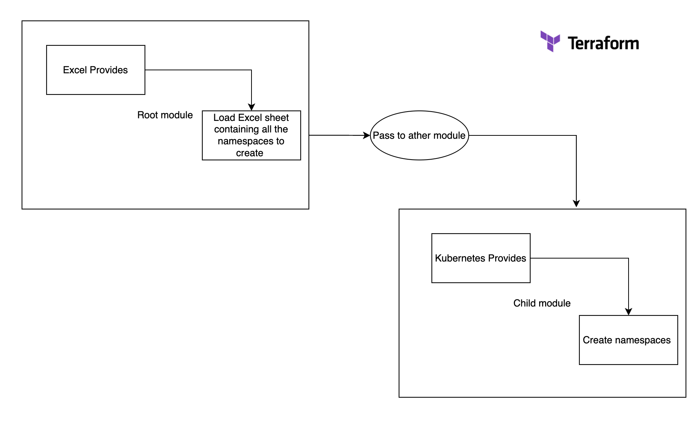

# Terraform Hands On

This tutorial demonstrate the use of terraform emphasis on: 
- Using providers 
- damage values (terraform data structures) 
- logic with control flow & loop 
- module : root & child




# Terrafrom workflow

```
terraform init
terraform validate
terrafrom plan
terraform apply -auto-approve
terraform destroy -auto-approve
terraform console
terraform fmt
```

## Types of Named Values
The main kinds of named values available in Terraform are:

- Resources
- Input variables
    - ```var.<NAME>``` is the value of the input variable of the given name.
        If the variable has a type **constraint** (type argument) as part of its declaration, Terraform will automatically convert the caller's given value to conform to the type constraint.
        For that reason, you can safely assume that a reference using var. will always produce a value that conforms to the type constraint, even if the caller provided a value of a different type that was automatically converted.
- Local values
    - A local value assigns a name to an **expression**, so you can use it multiple times  within a module without repeating it.
    If you're familiar with traditional programming languages, it can be useful to compare Terraform modules to function definitions:
    Input variables are like function arguments.
    Output values are like function return values.
    Local values are like a function's temporary local variables.
- Child module outputs
    - ```module.<MODULE NAME>``` is an value representing the results of a module block.
        To access one of the module's output values, use : 
        ```
        module.<MODULE NAME>.<OUTPUT NAME>
        ```
- Data sources
  - Data sources allow Terraform to use information defined outside of Terraform
- Filesystem and workspace info, can be used to  "Query Data Sources"

  - `path.module` is the filesystem path of the module where the expression is placed.
  - `path.root` is the filesystem path of the root module of the configuration.
  - `path.cwd `is the filesystem path of the current working directory. In normal use of Terraform this is the same as path.root, but some advanced uses of Terraform run it from a directory other than the root module directory, causing these paths to be different.
  - `terraform.workspace` is the name of the currently selected workspace.
- Block-local values
  - Within the bodies of certain blocks, or in some other specific contexts, there are other named values available beyond the global values listed above. These local names are described in the documentation for the specific contexts where they appear. Some of most common local names are:
    - `count.index`, in resources that use the count meta-argument.
    - `each.key / each.value`, in resources that use the for_each meta-argument.
    - `self`, in provisioner and connection blocks.


## Constract new data with expressions : 
```
> var.namespaces_to_create
tolist([
  "dev",
  "staging",
  "integration",
  "devops",
])
> data.kubernetes_all_namespaces.allns.namespaces 
tolist([
  "default",
  "devops",
  "ingress-nginx",
  "kube-node-lease",
  "kube-public",
  "kube-system",
  "monitoring",
  "nadav",
  "oms",
])
> { for ns in data.kubernetes_all_namespaces.allns.namespaces : ns => (contains(var.namespaces_to_create,ns) ?  "Exists"  :  "NotExists") }
{
  "default" = "NotExists"
  "devops" = "Exists"
  "ingress-nginx" = "NotExists"
  "kube-node-lease" = "NotExists"
  "kube-public" = "NotExists"
  "kube-system" = "NotExists"
  "monitoring" = "NotExists"
  "nadav" = "NotExists"
  "oms" = "NotExists"
}
```


## The Root Module
Every Terraform configuration has at least one module, known as its root module, which consists of the resources defined in the .tf files in the main working directory.

## Child Modules
A Terraform module (usually the root module of a configuration) can call other modules to include their resources into the configuration. A module that has been called by another module is often referred to as a child module.


Get child data from the root module :

Inside the child define :
```
output "data_kubernetes_all_namespaces_allns" {
  value = data.kubernetes_all_namespaces.allns
}
```

Then you can call in from the parant as :
```
module.aks-kubernetes.data_kubernetes_all_namespaces_allns
```


## »How to use Provisioners
You can add a provisioner block inside the resource block of a compute instance.
```
resource "aws_instance" "web" {
  # ...

  provisioner "local-exec" {
    command = "echo The server's IP address is ${self.private_ip}"
  }
}
```
You must include a connection block so that Terraform will know how to communicate with the server.

The built-in provisioners :  ```file```, ```local-exec```, and ```remote-exec```.

## »The self Object
Expressions in provisioner blocks cannot refer to their parent resource by name. Instead, they can use the special self object.

The self object represents the provisioner's parent resource, and has all of that resource's attributes. For example, use self.public_ip to reference an aws_instance's public_ip attribute.v

## Creation-Time Provisioners
By default, provisioners run when the resource they are defined within is created. Creation-time provisioners are only run during creation, not during updating or any other lifecycle. They are meant as a means to perform bootstrapping of a system.

If a creation-time provisioner fails, the resource is marked as tainted. A tainted resource will be planned for destruction and recreation upon the next terraform apply. Terraform does this because a failed provisioner can leave a resource in a semi-configured state. Because Terraform cannot reason about what the provisioner does, the only way to ensure proper creation of a resource is to recreate it. This is tainting.
You can change this behavior by setting the on_failure attribute.

